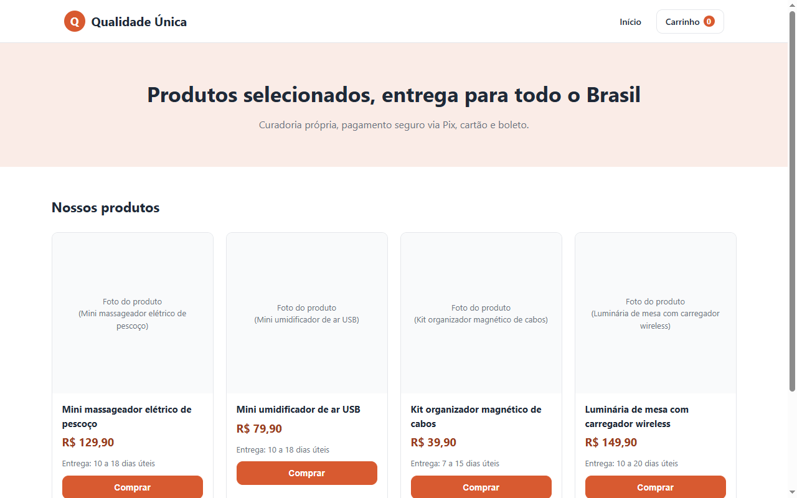
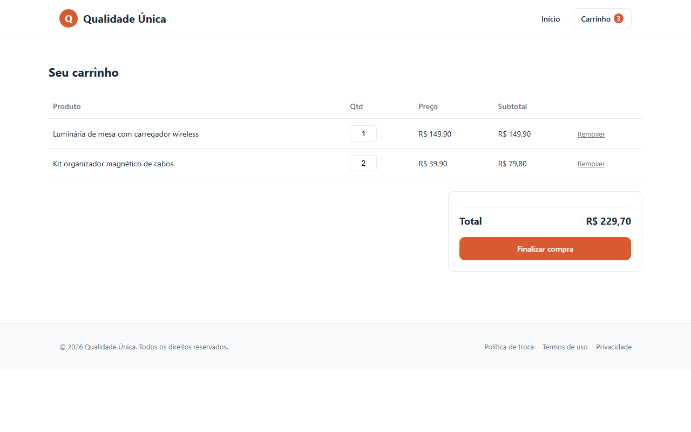
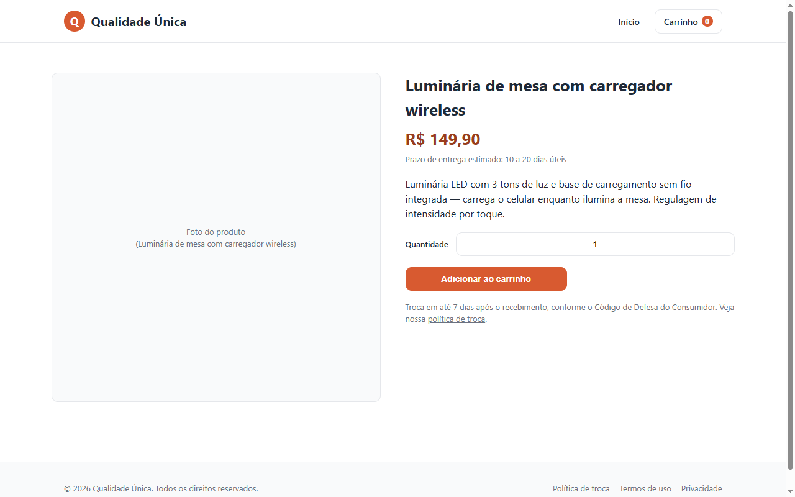

# Online Store with Mercado Pago Checkout

A lightweight e-commerce storefront built with **plain HTML, CSS and JavaScript** (no framework, no build step) and **serverless functions on Cloudflare Pages** that create payments through **Mercado Pago Checkout Pro** (Pix, card and boleto).

Built in one day as a complete, deployable store: catalog, product pages, cart, checkout, payment return page and the legal pages required in Brazil (returns policy, terms and privacy/LGPD).

| Catalog | Cart |
|---|---|
|  |  |



## Features

- Product catalog and product detail pages
- Cart stored in `localStorage`, with quantity editing and totals
- Checkout form that creates a Mercado Pago payment preference and redirects the customer
- Payment confirmation page (approved / pending / failed) and webhook endpoint for payment notifications
- Returns policy, terms of use and privacy policy pages
- Zero dependencies: deploy the folder as-is

## Architecture

```
Browser (static HTML/JS)          Cloudflare Pages Functions          Mercado Pago
---------------------------       ----------------------------        -------------
cart: [{ id, quantity }]  ──POST /criar-pagamento──▶  validates items,
                                   reads prices from    ──create preference──▶
                                   functions/_catalog.js
                          ◀── redirect URL (init_point) ──
                                   /webhook-mercadopago ◀── payment notifications
```

- `functions/_catalog.js` is the **server-side source of truth** for product names and prices. Files in `functions/` are not served as static assets, so internal data (cost, supplier) stays private.
- `js/products.js` holds only what the customer sees.

## Security

An early version trusted the `unit_price` sent by the browser, which meant anyone could edit the request and pay any amount for a product. It was fixed by:

- sending only **product id and quantity** from the browser
- looking up name and price **on the server** (`functions/_catalog.js`)
- validating product ids and quantities (integers from 1 to 20)
- moving cost and supplier data out of the public catalog
- logging Mercado Pago errors on the server instead of returning them to the client

The Mercado Pago access token is read from an environment variable and never shipped to the browser.

## Project structure

```
index.html, produto.html, carrinho.html, checkout.html, confirmacao.html
politica-de-troca.html, termos.html, privacidade.html
css/style.css                     -> all styles (brand color in --brand)
js/products.js                    -> public product list (display only)
js/cart.js                        -> cart logic (localStorage)
js/render.js                      -> page rendering and checkout request
functions/_catalog.js             -> official prices and internal product data
functions/criar-pagamento.js      -> creates the Mercado Pago payment
functions/webhook-mercadopago.js  -> receives payment notifications
```

## Running and deploying

1. **Products:** edit `functions/_catalog.js` (official price) and `js/products.js` (what is displayed). Keep prices in sync.
2. **Mercado Pago:** create an account and copy the **test** access token first.
3. **Deploy on Cloudflare Pages:** connect this repository, framework preset `None`, no build command, output directory `/`.
4. **Environment variables:**
   - `MP_ACCESS_TOKEN`: Mercado Pago access token (start with the test one)
   - `SITE_URL`: your site URL, e.g. `https://my-store.pages.dev`
5. Test a full purchase with the test token, then switch to the production token.

To preview the static pages locally: `npx http-server .` (the checkout needs the Cloudflare functions to run).

## Next steps

- Process the webhook: fetch the payment by id and send an order confirmation e-mail
- Product images and stock control
- Automated tests running in CI

---

Made by [Vinícius Fontanella Kleis](https://www.linkedin.com/in/vinicius-fontanella/).
